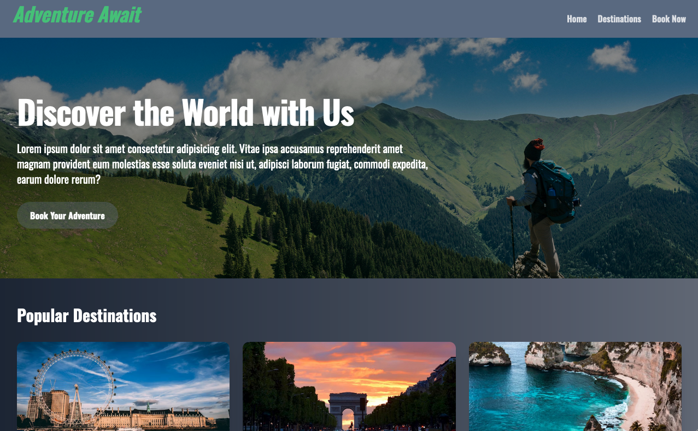
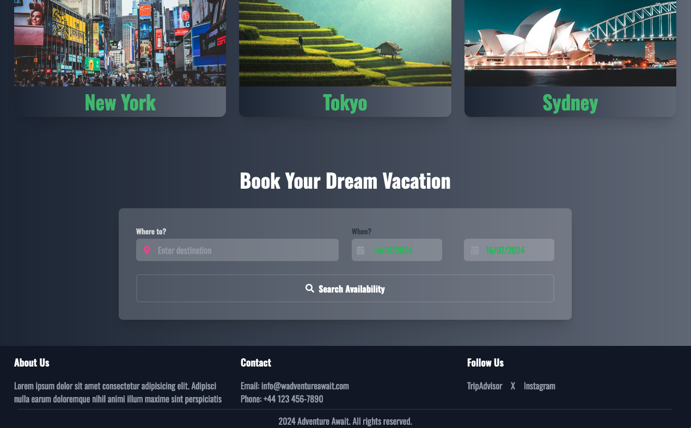

# Adventure Awaits: A Travel App UI Built with Next.js

### Technologies used

- Next.js
- JavaScript
- TypeScript
- Tawilwind CSS

### Live Demo

- Netlify: https://adventure-awaits-by-farhad.netlify.app/

### Preview

**1**

**2**


#### Getting Started:

**Clone the repository**:

```bash
git clone https://github.com/farhadxf/adventure-awaits-nextjs.git

```

**Install dependencies:**

- **npm:**

  ```bash
  npm install
  ```

  <button onclick="navigator.clipboard.writeText('npm install')"></button>

- **yarn:**
  ```bash
  yarn install
  ```
  <button onclick="navigator.clipboard.writeText('yarn install')"></button>

**Start the development server:**

- **npm:**

  ```bash
  npm run dev
  ```

  <button onclick="navigator.clipboard.writeText('npm run dev')"></button>

- **yarn:**
  ```bash
  yarn dev
  ```
  <button onclick="navigator.clipboard.writeText('yarn dev')"></button>

#### Author

- [Farhad Hossen](https://farhadx.com)

#### License

This project is open source and available under the [MIT License](LICENSE)
